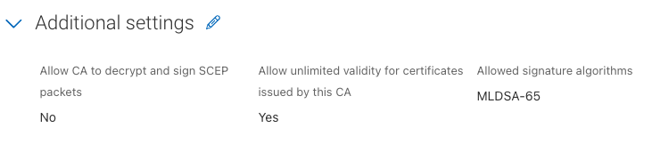

# Create PQC Demo Lab

Before creating a new PQC related profiles, you will need to create a new root and ica as each key requires its own root and ica



## Compile OpenSSL 3.5.1

By default, the OS integrated OpenSSL version does not support PQC and there is currently (July 2025) no pre-compiled version of OpenSSL that does.

So we need to do that ourselves.


Update and install the following pre-requisites

```bash
sudo apt update
sudo apt install -y build-essential jq git perl python3 make wget zlib1g-dev libssl-dev
```


Clone the OpenSSL Branch

```bash
git clone https://github.com/openssl/openssl.git
cd openssl
```


Configure the build

```bash
./Configure --prefix=/opt/openssl-pqc linux-x86_64
```


```bash
make -j$(nproc)
make install
```


Add the new binaries to the path and make sure the right libraries are linked

```bash
export PATH="/opt/openssl-pqc/bin:$PATH"
export LD_LIBRARY_PATH=/opt/openssl-pqc/lib64:$LD_LIBRARY_PATH
```

To permanently add these two lines to the end of your bash profile `~/.bashrc`


Now you should be able to check for the PQC algorithms by using

`openssl list -public-key-algorithms | grep ML`

For example:

```bash
openssl list -public-key-algorithms | grep ML
  Name: OpenSSL ML-DSA-44 implementation
    IDs: { 2.16.840.1.101.3.4.3.17, id-ml-dsa-44, ML-DSA-44, MLDSA44 } @ default
  Name: OpenSSL ML-DSA-65 implementation
    IDs: { 2.16.840.1.101.3.4.3.18, id-ml-dsa-65, ML-DSA-65, MLDSA65 } @ default
  Name: OpenSSL ML-DSA-87 implementation
    IDs: { 2.16.840.1.101.3.4.3.19, id-ml-dsa-87, ML-DSA-87, MLDSA87 } @ default
  Name: OpenSSL ML-KEM-512 implementation
    IDs: { 2.16.840.1.101.3.4.4.1, id-alg-ml-kem-512, ML-KEM-512, MLKEM512 } @ default
  Name: OpenSSL ML-KEM-768 implementation
    IDs: { 2.16.840.1.101.3.4.4.2, id-alg-ml-kem-768, ML-KEM-768, MLKEM768 } @ default
  Name: OpenSSL ML-KEM-1024 implementation
    IDs: { 2.16.840.1.101.3.4.4.3, id-alg-ml-kem-1024, ML-KEM-1024, MLKEM1024 } @ default
  Name: X25519+ML-KEM-768 TLS hybrid implementation
    IDs: X25519MLKEM768 @ default
  Name: X448+ML-KEM-1024 TLS hybrid implementation
    IDs: X448MLKEM1024 @ default
  Name: P-256+ML-KEM-768 TLS hybrid implementation
    IDs: SecP256r1MLKEM768 @ default
  Name: P-384+ML-KEM-1024 TLS hybrid implementation
    IDs: SecP384r1MLKEM1024 @ default
```
