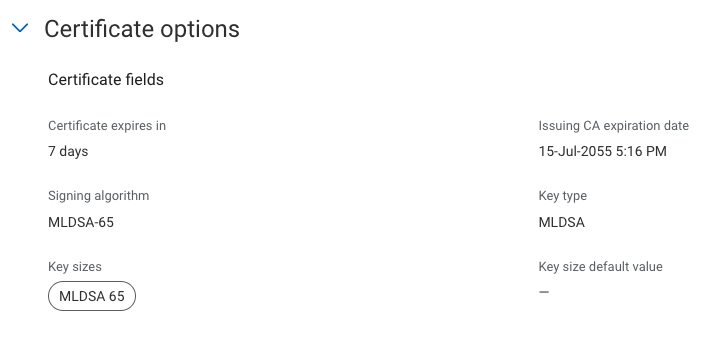
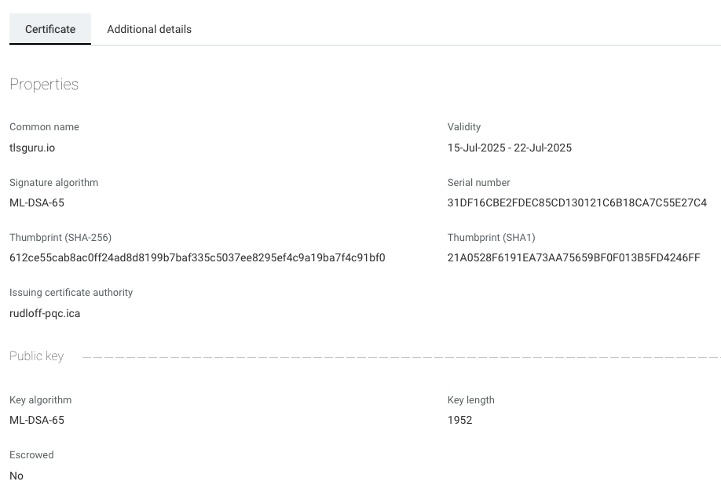

# Create PQC Demo Lab

Before creating a new PQC related profiles, you will need to create a new root and ica as each key requires its own root and ica


## Compile OpenSSL 3.5.1

By default, the OS integrated OpenSSL version does not support PQC and there is currently (July 2025) no pre-compiled version of OpenSSL that does.

So we need to do that ourselves.

Update and install the following pre-requisites

```bash
sudo apt update
sudo apt install -y build-essential jq git perl python3 make wget zlib1g-dev libssl-dev
```

Clone the OpenSSL Branch

```bash
git clone https://github.com/openssl/openssl.git
cd openssl
```

Configure the build

```bash
./Configure --prefix=/opt/openssl-pqc linux-x86_64
```


```bash
make -j$(nproc)
make install
```

Add the new binaries to the path and make sure the right libraries are linked

```bash
export PATH="/opt/openssl-pqc/bin:$PATH"
export LD_LIBRARY_PATH=/opt/openssl-pqc/lib64:$LD_LIBRARY_PATH
```

To permanently add these two lines to the end of your bash profile `~/.bashrc`

Now you should be able to check for the PQC algorithms by using

`openssl list -public-key-algorithms | grep ML`

For example:

```bash
openssl list -public-key-algorithms | grep ML
  Name: OpenSSL ML-DSA-44 implementation
    IDs: { 2.16.840.1.101.3.4.3.17, id-ml-dsa-44, ML-DSA-44, MLDSA44 } @ default
  Name: OpenSSL ML-DSA-65 implementation
    IDs: { 2.16.840.1.101.3.4.3.18, id-ml-dsa-65, ML-DSA-65, MLDSA65 } @ default
  Name: OpenSSL ML-DSA-87 implementation
    IDs: { 2.16.840.1.101.3.4.3.19, id-ml-dsa-87, ML-DSA-87, MLDSA87 } @ default
  Name: OpenSSL ML-KEM-512 implementation
    IDs: { 2.16.840.1.101.3.4.4.1, id-alg-ml-kem-512, ML-KEM-512, MLKEM512 } @ default
  Name: OpenSSL ML-KEM-768 implementation
    IDs: { 2.16.840.1.101.3.4.4.2, id-alg-ml-kem-768, ML-KEM-768, MLKEM768 } @ default
  Name: OpenSSL ML-KEM-1024 implementation
    IDs: { 2.16.840.1.101.3.4.4.3, id-alg-ml-kem-1024, ML-KEM-1024, MLKEM1024 } @ default
  Name: X25519+ML-KEM-768 TLS hybrid implementation
    IDs: X25519MLKEM768 @ default
  Name: X448+ML-KEM-1024 TLS hybrid implementation
    IDs: X448MLKEM1024 @ default
  Name: P-256+ML-KEM-768 TLS hybrid implementation
    IDs: SecP256r1MLKEM768 @ default
  Name: P-384+ML-KEM-1024 TLS hybrid implementation
    IDs: SecP384r1MLKEM1024 @ default
```

Testing via API

Once you have a PQC root and ica - create an API profile. Here I have an `Dilithium ML-DSA-65` API profile using my `PQC ML-DS-65` root / ica



## Create your Key / CSR

Create a `csr.conf`

```bash
[ req ]
distinguished_name = req_distinguished_name
prompt = no
[ req_distinguished_name ]
CN = tlsguru.io
O = Digicert
C = US
```


Create the key `mldsa65_key.pem`

```bash
openssl genpkey -algorithm MLDSA65 -out mldsa65_key.pem
```


Now create the CSR

```bash
openssl req -new -key mldsa65_key.pem -out mldsa65_csr.pem -config csr.conf

```

When you now open the CSR `mldsa65_csr.pem` you will notice how much longer it is.


## Use CSR and Submit request via API to issue certificate


The following script will now convert the CSR into an API friendly single line and submits the request via API to TLM.

Make sure you change the details, such as API key, Profile ID etc. accordingly !!

Create the script and make it executable with `chmod +x <script>`

Once created you can simply start the script by specifying the CSR, for example

```bash
issuance.sh mldsa65_csr.pem
```


```bash
#!/bin/bash

# Script to extract CSR and make DigiCert API call
# Usage: ./digicert_csr_api.sh <csr_file>

# Check if CSR file is provided
if [ $# -eq 0 ]; then
    echo "Usage: $0 <csr_file>"
    echo "Example: $0 mldsa65_csr.pem"
    exit 1
fi

CSR_FILE="$1"

# Check if CSR file exists
if [ ! -f "$CSR_FILE" ]; then
    echo "Error: CSR file '$CSR_FILE' not found!"
    exit 1
fi

# Extract CSR content (remove headers and newlines) - using sed method
CSR_CONTENT=$(sed '/-----BEGIN/d; /-----END/d' "$CSR_FILE" | tr -d '\n')

# Check if CSR content was extracted
if [ -z "$CSR_CONTENT" ]; then
    echo "Error: Could not extract CSR content from '$CSR_FILE'"
    exit 1
fi

echo "Extracted CSR content (first 100 characters): ${CSR_CONTENT:0:100}..."
echo "Making API call to DigiCert..."

# Create a temporary JSON file to avoid escaping issues
TEMP_JSON=$(mktemp)
cat > "$TEMP_JSON" << EOF
{
    "profile": {
        "id": "27559841-9785-4157-ac95-3f9ec41114e5"
    },
    "seat": {
        "seat_id": "tlsguru.io"
    },
    "csr": "$CSR_CONTENT",
    "attributes": {
        "subject": {
            "common_name": "tlsguru.io"
        }
    }
}
EOF

# Make the API call using the temporary file
curl --location 'https://demo.one.digicert.com/mpki/api/v1/certificate' \
--header 'Content-Type: application/json' \
--header 'x-api-key: 013b98d6c0e34155bda3a6d0e2_93d6675eeeed2205e31cf750e7c5c0ddd893085454c9abb6ec59a704965c0d41' \
--data @"$TEMP_JSON"

# Clean up temporary file
rm "$TEMP_JSON"
```


Example output:

```bash
Extracted CSR content (first 100 characters): MIIU9TCCB/ICAQAwNTETMBEGA1UEAwwKdGxzZ3VydS5pbzERMA8GA1UECgwIRGlnaWNlcnQxCzAJBgNVBAYTAlVTMIIHsjALBglg...
Making API call to DigiCert...
{"serial_number":"31DF16CBE2FDEC85CD130121C6B18CA7C55E27C4","delivery_format":"x509","certificate":"-----BEGIN CERTIFICATE-----\nMIIWwjCCCb+gAwIBAgIUMd8Wy+L97IXNEwEhxrGMp8VeJ8QwCwYJYIZIAWUDBAMS\nMIGPMQswCQYDVQQGEwJVUzELMAkGA1UECBMCR0ExEDAOBgNVBAcTB1Jvc3dlbGwx\nDjAMBgNVBBETBTMwMDc1MSAwHgYDVQQJExcxNzAgQ29jaHJhbiBGYXJtcyBEcml2\nZTEVMBMGA1UEChMMUnVkbG9mZiBJbmMuMRgwFgYDVQQDEw9ydWRsb2ZmLXBxYy5p\nY2EwHhcNMjUwNzE1MTgxNTQxWhcNMjUwNzIyMTgxNTQxWjAVMRMwEQYDVQQDDAp0\nbHNndXJ1LmlvMIIHsjALBglghkgBZQMEAxIDggehAJoD+GRwhoYSl2Sn0/SMYtDI\nFt9hPdhXSbxFujX1HX49Ci0fVF5FRIgnH/rncjkWYFAjHuBbvBnIvf1OrWWqq5bb\nCHpPAqmam/NocPWp+FnUUUCGDURoOjuulU8lkTwYLUusiOD2TczxSM7VWQtGhJUO\nn52SVEOCybP0qkYEO0rRFGrhQmTkTz6OP3FZoTUc7jhWJffS5Gb1uCYehbrTmnJ0\nrpdduYSLsLWT6eRHFp4GClxWgOTIHDmH34mTnq1P/rABr8Osyn1axbHQ7jxwNzLP\nLVUnWdUj1xOpFWx2YyRstixSMkfHQnpYagAimVl1HR5ckNAD8ffVMPX3yJfjlwn4\nT2BQQp5qRcZJRWvyKUwpqgCPWQOIJK7e8QqcA/cCVUBkA5aPJK4WH0gtaelHjGls\nhsx9pj6oTEu+oL1sk4TsKWmB8+FcRaHeK7vV7gSREWJUfeSAd099PeLmqdmvFfWY\n+E6JBt8+HxKhS6akBJ7pyK2y9Xef2IzHhnFkQVK27fklNCdYOAg63XRXj0CBLX0c\nXD+XfxjETNSlbpOZMgoxnGfTuuNKGq3cZQqRoCLJ6jmZo/QRN/ifSaVbZhjbUIdz\nS+qnQ9o/NHxkqvsRaP/sEWGH1HogmhDsBXQ0ZktmhhcYo+LSuHYKau2VrglOqJz7\nJar7zkq9oMfFenP5d8i2AvKGFxfNXziUq6q3pnmXWWw7YLdhxUG7DGrCmZkttZwQ\nYKKUXo42roWYjvMj6b22n1kAok2TTb3+AmmAGhZAS6LlIWUeSGyLKpCsdTrmVO7I\nmuBTISMhccW2UgCUgzE3e5spLMk41V3VG/4OZPg+PdzVeqnUY88dCaf4SQwraCyN\nkIQORc2NvI3EWkGFWc3HyAAVbD3H/qeQjkwBWlVMniYfphnehmoLclbXL9kCoWEI\ntgpoDcEN1Z4bbOkpDnxLlLI6VbdLRiBkpHyq8FUm0vvW2sCfHiaWhynd97ZkhFLN\n688mkSaNZeBA2la6Q1rJs8grwJ7r4V9OCoOSOfKfTItAJPhj0HkGmNBFqzngOTUJ\niWnwbpK1QdNecu7znd33dIgrr32j4efNxrX6wqwdnTtRnYZBZmVtKGUhFc3T0RFp\nqtyUjSXS7+uMIoK61brs/tpNrmDSyAHLSArt6sd8iOzq3X+wW7wR2LkF7NpzK3kr\nDKAgaMzz/u79myXJBJ18hmF5iAJbdMd6DFof95uafKJ6LkAjsDtn2XIbL8zD7ogB\nrYmxwmAqxh81JcltScEJ9XQJY6yTkUpCIRHjMh7fcBrfmqDR3Xv/DYma/aykfuDd\nx/4GOwyx2SBpwqC87SVdNvzpQwSQPt5u9N3q7m39srTD2apZaX7clanKR7/uPeg+\nXEHFbr9mroSlQZTj/fngVfdWUElLLenWfj5FBqyXWdBtFFUdYL6bV0sfPG18oFbJ\n7wO5SLL/g0cSKciKa4p7O1parFtimkOjXh8daBIOgUzGda7CcpnpNEgjQN7XEcy5\ndV2FSIN/GLY49cLDbfcAB6NRa3WVuB5NQHXrrLU1LCv0H6xBGkAegEYVnkYKtYVc\njAUIDZyT7fHc5GgSpQ++t/nzyw836d7IWdJirM6LfiRX8vDyqnotWKUkhA+d3AHK\nBby1HQVDgo4PVtN7PehI4XvLWyKUX+ggb48SAtG4QZN2389g7vkbrJpQ3pLO+XRi\neUhBxvcm6ytPhbheG2AF+T5UTnptlmLc5Lyju+Vidwth9jTpC32P7uFglPpUoaE8\nDgysyi1WXz3r81i32fFpCNe6bDgOrzxTSx9wWnHG+Pasy/UCCaZ259hFgY+dlil4\nq8jn24lHvWquW6wEzxIcsuCceL6S0KJfUGy9PIchkCPEmOMZoNPjQJPwPKayQZd2\nQGmiU5T1BwUUbIQvyAEw74oEhNlqczeA+f+s8Yl9UCOteuqGyenp0QQ/71IF1AKR\nttQixEWINBoSiz5/PVpU+OIFVw5BOTX0RmBDiaP+D0M6RU02jcLKiF/QfIW9nBp1\nTvtsahmwuDUnz+1f5mwH9PuS6qU+n9VSohjpEg3YdOBfi+1iAfjQpsT42SOiGeMu\n2vKGggYc9ZkUocGrRlKRlVW0c3kAMXDrGhhVonyRtNLtdzxxzs2GAIghQvt8P2Uq\n/GkziGlua1QXsPk+KZqQi+TY1LhYIvdmMiGOVweoHyP35JL5k0bfXDlLPCNK9o79\nnyWR197X900OTWKPNoDZkmUM9DMBuIkfiMZtHSJp6eqP1Lzm5RpuUGlwDKdMY+g3\nytPjRawgs6TMbAYg+YeuNALIEdaX92Y/zTiguVxY2ryne/NYGanfrfgf5xobu/xk\ntjB9fCd1nTfZRFKaHJmJhA4pxbjcU0WUH3DSzuCcVsya7U7ZzhWwAAIdX1oJuuGf\nyOFge5njtu1B2HpH6jIE6lHIQ8K+a94ACjk2T9n7DVcDxjXp1wwinGXFK4DyTsmH\nv140F8NTlZvKIi8PZNsMHZg/zDNTWZ5YpAz0w+dkFVcanKVhubh1Ct4R+Kh4EUXi\nbm1W9I8yagSHqp00ZM7Rz/Ce7rQwo7DgIM1TCA90qWzt07WTeYSCDYMuZKs92gaw\nrmEyFOFZRA8JNlec1p1wo4IBFDCCARAwDAYDVR0TAQH/BAIwADAdBgNVHQ4EFgQU\nHe+V62K6XbSbYU4CACcrB97zN4MwHwYDVR0jBBgwFoAUkPmrHbVnh8th5lKz5+5I\nUQFbk+YwDgYDVR0PAQH/BAQDAgeAMBMGA1UdJQQMMAoGCCsGAQUFBwMBMFQGCCsG\nAQUFBwEBBEgwRjBEBggrBgEFBQcwAoY4aHR0cDovL2NhY2VydHMuZGVtby5vbmUu\nZGlnaWNlcnQuY29tL3J1ZGxvZmYtcHFjLmljYS5jcnQwRQYDVR0fBD4wPDA6oDig\nNoY0aHR0cDovL2NybC5kZW1vLm9uZS5kaWdpY2VydC5jb20vcnVkbG9mZi1wcWMu\naWNhLmNybDALBglghkgBZQMEAxIDggzuAJZxO9f7uEeMdSDxivNewimEjzVKJzA2\nsgwgo4B9nuz4IH0miNzMlRUqrQw8mG3KVmG155j7k3iVN8VaeSmFcNqFvHN4CjUj\ngiUnpqBpci9H4uhE0fF2+xIeJR+Y21/fHAx3CWED2TYYnaUsQnsZPSuIt5H1dMh0\nEvcesSo3agMUFfgnQqW9fqTCKv9H9wj1/OGEDHdCtTz6h/YBtA++owRAr58ZdDxN\nKyZSUoOAl/xQCOBG3szsAWp5nB8haHX6Vhb19QAPleMF6cOyxJV1Uz7a9hE+G49Y\nUtE9+DnVs+VjW/3UG5pfiIhFEjdTLEM0EU3MtQORTxB1gqQI79iKMv/r1ebWgqRz\nqmS6+HxKuIZCrdJ0KrriYc4SQVxv4iVCOA2TrIjDkrrEg5fb+KsdKOBD9egVrWX/\ntgcD1LUdgRybYFW8L8SvWZs0W5s1SBPghkaFX13/L0UA474m+MdnYnh1WLyGmMIa\nrFW4haXvsN1gmzihzIln873xepK14HTxaFAcRB42zRdHWTx1xy8u4GaoMUhQ1Jtu\nj3iAeq9Y1EMd+z/gAzbMGpTc+Hn73vOA/Kblw0FS88n95CgAm90TTWOGywqlp11Y\nhoJZ7plNzRSNC2ZFytpWmFndhos0MWRe3DDyMV2bEpJvEqYHnJmC5AHSnD1IpZY7\n+nwnoXuCDNQl9x+qC0jf4XqrRjpJIf/oJcwCXV7X2s3gTdfVnwx3ybsrWgSX+ELZ\n5lho24uyI0W8F9J++sM78xBmqDg0+0hjFpxzx4bv+nrqFdJHcxpABp9L2hXQeSgZ\n2AejaFVQCE0E5Bh1Iy9MevltncL87tqb8F3UhHNgNzkM09zFiXFMmzLklLXQ8LGW\nXW2svCZa8CLsClZBBhPVXWblS4v0OajTB8xmmDiVwauhVwt3A641BnKbfJXfbeTK\nIaxtQd9gItEhpGm1mSQDep1EwDPMW0OEgdc6bikzlVWd3c9S+hyirTuh3vsewPq4\nSNKQG9qTLeJC2rlOaObVfctZvfAdGD1QcIkCoCacwkfugQig9QmgmDOd6XxCe7t6\nxL6dXAvh6yXQEXlWZ7g7IBpp/lAl9T31OHosj659m6fW/P1IjfigSbDZBgOXbcZN\nnV+2JMgKDhCZy3rAz8swdgL2BYbY5mr+LWBX6mrGxiXu4kcudPrPNri8nShDlt3f\nZPYM/Zb0kl1eE+ONYuwU+esihB3AlWAYDsFBAiO9bvsGiDtAjJuM5zFdUR8YyDsz\nKc15VDzE3n3R7uyX14BMj45P1QgN4d6SjXpvg2qk2d92WWh2oMMmnYoM9xLb+uPx\nOmhWjCntOiYS2R0/3sXCHmcWQDAkC3krXbDD+jfa2hQER9A9APzW4OWEy/3Gcra8\nCYwNuosPUxHSIActUjIE9YbLACKrcweHaG+AePaIhbVknm9PxpWNm5sumB2CBqbA\nA8ApSczCYiz5u4ujvQhdJcktJc6He9qIL51nyRVbVuk5uA7HPlTd/l1dFMYgsPLV\nCJEf9+neORgTX7R6MRkbbFSQVckdhDJUedUxwhlSznBEYRwON0Ghe7YBk+COzkrp\nQq2Q8yQqEZ/0PD/TaPffGNJXobeAKhHYOmdr4EIqnVd6FNg5EOZ8OObovAjENjL4\nqlp+wSQ9YU3GA0X1Y53fU2hXi+Mflwb5LyGxDpQHkdsc26EiP1IvfkHu4D4WmYGS\nbDSSDUsLhaoa5J+/HWpfTTCQHkoI9LZcls5ocHm4+4JgVlIip2x1r5xmfHcEA1Si\nPPfzPu2w8PdgL0sfIC1IB0HzqSeJCcmeCO72ULJWsXp0S0eyeMi+rPbJYrl+OHri\nzB5cHdySs+6+kXYJAPbdot9TrGhh186epoiCQD5U9ZFHt1LqJuKAVrl3Qq9HVRiF\n6W36aKPhQtx9xsNS/UC7s9LgahGLIAZgBrfeXin22L5EL3AENscemu4t90MXnede\nosDfJbNNX42xmMs5iCzo37FL81yk4g5yZZe6Yba1vLxYGpEJgwtfx7b+1G5mK00r\nVh0pfl3bgY8XpbZ60nzM2g8Izz4XYoXRULm75Vg0r3Aqi0UEKnAUTEhO1OPBEi+8\nFbOBbUL0cHOIZE8TL5262UlorCT1tyEgxDGu2MD4/UQMvESzIMwh3Vj+YUiYX2fv\n+hWJQxRZdpy/GflLkQC5sk2hsitpVzoldAo9RavBbQqmPLljGXcbFiDvJTQCzWgn\nloSJY5TZqbjOQiwnAN2/5NbafZTTUFLloxWh1kkjT8BAlcnxmrtOI0sOImLVwMoJ\nQLxo0vEKedttJOw+NBxOsz2NL4keH+XdsYdAQsmlYGgPjzi8v7PmUtgQD+C3hW5S\nL7shuhq2xgN5W02sNikeoTsQexK72ft9HMicg0BFM7VFEYqSOGyOznL6qdzWyD5f\nEqxyJVjRXMapZ9VO6+UXkcKhiTWDKA3UtZoeXr+LzErqESxd7uRV5PphmUHixeSp\nhbihSeg07IjwotH/0O2Zc8EeStUL9RF6X0oBvOybV7V8rxyFWQd2V7TnP+6GS0RR\nv/F+635fgAZlBz+ycljhCmvP8xTahblp7dX5yxLNs/RCMpsjHgRr70W1rDu0/0Ld\nTO4zIqTxKXY+7SUMWga76vzs37MpmikZEGgqHwJqMm5exVkYzU77KHvNfXwks9VJ\nRdfF+FOxv2MeNY/4VAF5zzSOf/l58n2BKeHOCqFRs9kRbvlg6RJGwdZMw4wp/A/I\ns1f/kQts1MIcQeM6vtd2AAi5vAolHXTjCiaH9vGxhdTxluWSeWnJDq0xSnc8A7zb\nM0OKh/KM6yTY1waERSJa/7tTks8Mg5pKz9Z6T4J4HpMI5XVYCcBOwLkFkeASypto\n2EUuUv8yviBap0qx6Syh1d6+Baf3fQp+NokQUhlGSTQnmz73vvnKW30A4dTXsX8G\n51FwuLSH6oVcs2UN+e0j7lw89YnUP0MuqbIOKNG77HQ1jU/1xVfEp7MCA1roZqLe\nozDQz3+WdP6BRq8j4ZQOn8q2Dw7jvPbTikDfdKTgR9wO145gTkneYN3sofOLKkH0\n0FuJJsa3QpAPhDBZlwgbqEdvsfYBSek382BHSELEuFFGkpIlc8NqkpnMHKkOp3tD\nc0tEg8nSVY2sN2IWLpx93se3+Yb5huqCAcavIAXWKayoa+CA+Id3SAn4HnYDeBxc\n5NJy7evQuldLop+GNPvUBD0m3ZeG1Ql3HLDwhm2EBu2dSQiD91HqYeU6R5aMywbS\nd7/0zd4Cs2jsRlGSPVUlCie1BcZFbgNiDGeIaNIPVOiI2qY8Zv4Wm0U/eVQTJOex\nKaQwnLHBK/E5/OSWv6PqX789MOuUu3YGk3x+5m/3tZzgIuC0igd2oKqrG9d7uv6Z\nn2c1Uq4xC40s1Q0k9eKquTGLRqBucyh3AGMNhvQ7XOe+xevtOyP8yh79dk1A6hZX\ntqzZG8sZ8cShA3WEcbADWxfhEFAscSuwCAkNVlwRVW9fDmpoz+L5KRBz1fMArco5\nqe1MFIKtyI8ZmTlIxNc0K2fpuydgPmGgfP/YwxlXC2EWuhxnlQUrz1iqWMVyPo8k\nu39zD5b87yRQnwZf4m92TkItUXn/mgwdA8O2phZb4lDwdsP5FMKBRjADj1HaZnFh\nNW9wmtnZwgEYJO4ekx9b90ISGscM8HMf6LnOa0Y2X9iMaNJBBR6c5gRqdRTVyOUh\nKLetKMn9dHY62Bm9Hp8PvlkRTP16p0NaOZRC1JQGg4bOWR6ceW1VV1Zucg+26s23\n5en2iqV9TKXgFlcZfHyNy2pw0uWsyHvZDag/zpUGRkn2Ycog2kKzhG49TZeBJcGL\ndqFuYkvaGcQ/Fa4mLQdgpSQzGMQNARI7bGE4ngHS6dMd1/kar0VWEQgfgw149z/O\noi78jC7qqQZCMxwx82spKSi5uh2m0TY2R23vbt1wAKmWB+a67XGT2YjxZSzF1aqn\nDx0UpFSXTSlG+xCP8aqosldYLxSsSBPmEv64ikvY8jC6k1UQIkI5pDIdX7FZ6rS8\nIG+QArjSpwRaBNdCYdkE/PsIwnMaB80HjCuxsRxKQ2yETqqCBSz0BNT9d+unGOMe\nkK3zDxOUx4dJrdc8TEqrRcYJKMrYaEfyv9Fbc2eUK+a9cfDZS+6JGC8kGdrsGOoX\nXgcBIJrTGk9jOotCv3+h4M/63IzzMVrlH2q0esQH6dqMS2zGZDWb2wzGhwZEzADK\n66J73QfUs1F9Oc454KxVUJYDkG2BftM8F91OOkI30fj/mxQWrs7P2hlwcxZByWWH\n7AO/hXLU1bEevaQjswDsvd7rDC4RdVIqVY7SyFfjUtl1WhiXBQ796DjK1wrhoiYV\n623dHTHXMW6AChtHa2yHkJPfJ4Gdv8fmLS82dobzHSMtNU2utuqJjKCktL/T7qXR\n+QAAAAAAAAAAAAAAAAAAAAkPFR0lKA==\n-----END CERTIFICATE-----\n"}
```


You can then see the certificate in the inventory and confirm it is a PQC one:





## Install / Compile Nginx to work with PQC OpenSSL 3.6


Deploy pre-requisites

```bash
apt install -y libpcre3 libpcre3-dev zlib1g-dev
```


Extract source

```bash
tar zxf nginx-1.27.4.tar.gz
cd nginx-1.27.4
```


Configure the source code. Please note - the last two lines are based on the openssl install through this guide - the path may change depending on the configuration

```bash
./configure --with-cc-opt='-g -O2 -fstack-protector-strong -Wformat -Werror=format-security -fPIC -Wdate-time -D_FORTIFY_SOURCE=2' \
    --with-ld-opt='-Wl,-z,relro -Wl,-z,now -fPIC'      \
    --prefix=/opt                                      \
    --conf-path=/opt/nginx/nginx.conf              	\
    --http-log-path=/var/log/nginx/access.log      	\
    --error-log-path=/var/log/nginx/error.log      	\
    --lock-path=/var/lock/nginx.lock               	\
    --pid-path=/run/nginx.pid                      	\
    --modules-path=/opt/lib/nginx/modules              \
    --http-client-body-temp-path=/var/lib/nginx/body   \
    --http-fastcgi-temp-path=/var/lib/nginx/fastcgi    \
    --http-proxy-temp-path=/var/lib/nginx/proxy        \
    --http-scgi-temp-path=/var/lib/nginx/scgi          \
    --http-uwsgi-temp-path=/var/lib/nginx/uwsgi        \
    --with-compat                                  	\
    --with-debug                                   	\
    --with-http_ssl_module                         	\
    --with-http_stub_status_module                 	\
    --with-http_realip_module                      	\
    --with-http_auth_request_module                	\
    --with-http_v2_module                          	\
    --with-http_dav_module                         	\
    --with-http_slice_module                       	\
    --with-threads                                 	\
    --with-http_addition_module                    	\
    --with-http_gunzip_module                      	\
    --with-http_gzip_static_module                 	\
    --with-http_sub_module                         	\
    --with-pcre                                    	\
    --with-openssl-opt=enable-tls1_3               	\
    --with-ld-opt="-L/opt/openssl-pqc/lib64 -Wl,-rpath,/opt/lib64" \
    --with-cc-opt="-I/opt/openssl-pqc/include"
```


Compile Nginx

```bash
make
make install
```


Create Nginx folders

```bash
mkdir /var/lib/nginx
mkdir /opt/nginx/conf.d
```


Change Nginx configuration `/opt/nginx/nginx.conf` … add to the very first line

`user www-data;`


Example:

```bash
user www-data;
#user  nobody;
worker_processes  1;

#error_log  logs/error.log;
#error_log  logs/error.log  notice;
#error_log  logs/error.log  info;

#pid        logs/nginx.pid;
```


In the same file - look for the block starting `http {` and add ` include /opt/nginx/conf.d/pqc.conf;`

Specify here the newly created certificate and key

Example:

```bash
http {
    include       mime.types;
    include /opt/nginx/conf.d/pqc.conf;
    default_type  application/octet-stream;

    #log_format  main  '$remote_addr - $remote_user [$time_local] "$request" '
    #                  '$status $body_bytes_sent "$http_referer" '
    #                  '"$http_user_agent" "$http_x_forwarded_for"';

    #access_log  logs/access.log  main;

    sendfile        on;
    #tcp_nopush     on;

    #keepalive_timeout  0;
    keepalive_timeout  65;

    #gzip  on;
```


Create TLS configuration. Create file `/opt/nginx/conf.d/pqc.conf`

```bash
server {
    listen 443 ssl;
    listen [::]:443 ssl;
    server_name example.com www.example.com;

    root /var/www/example.com;
    index index.html index.php;

    ssl_certificate /opt/certs/pqc.crt;
    ssl_certificate_key /opt/certs/pqc.key;

    ssl_protocols TLSv1.3;
    ssl_prefer_server_ciphers on;
    ssl_ecdh_curve X25519MLKEM768;

    location / {
        try_files $uri $uri/ =404;
    }
}
```


Create daemon / service

Create the file ` /etc/systemd/system/nginx.service`

```bash
[Unit]
Description=The NGINX HTTP and reverse proxy server
After=network.target remote-fs.target nss-lookup.target

[Service]
Type=forking
PIDFile=/run/nginx.pid
ExecStartPre=/opt/sbin/nginx -t
ExecStart=/opt/sbin/nginx
ExecReload=/opt/sbin/nginx -s reload
ExecStop=/opt/sbin/nginx -s stop
PrivateTmp=true

[Install]
WantedBy=multi-user.target
```


Start Nginx

```bash
service nginx start

```

Test the certificate on the TLS site

```bash
openssl s_client -connect localhost:443 -servername localhost
```

Note: There is currently no web browser supporting PQC certificates so openssl is currently the best way to check that the https port is bound with the PQC certificate


The output should be the cert with its details

Example:

```bash
subject=CN=digicert.local
issuer=C=US, ST=GA, L=Roswell, postalCode=30075, street=170 Cochran Farms Drive, O=Rudloff Inc., CN=rudloff-pqc.ica
---
No client certificate CA names sent
Peer signature type: mldsa65
Negotiated TLS1.3 group: X25519MLKEM768
---
SSL handshake has read 22248 bytes and written 1546 bytes
Verification error: self-signed certificate in certificate chain
---
New, TLSv1.3, Cipher is TLS_AES_256_GCM_SHA384
Protocol: TLSv1.3
Server public key is 15616 bit
This TLS version forbids renegotiation.
Compression: NONE
Expansion: NONE
No ALPN negotiated
Early data was not sent
Verify return code: 19 (self-signed certificate in certificate chain)
```


If you do not add the chain to the local cert store, you will get messages such as

`SSL handshake has read 10531 bytes and written 1546 bytes Verification error: unable to verify the first certificate`

This is expected until you add the root / ica to the cert store.


## Combined / Expanded script


This script now takes care of the CSR creation and offers configuration parameters during the start.

It will also combine the root / ica and issued certificate to a fullchain certificate and updated NGINX accordingly. Note that this is quite an advanced script.

At the end of this article you will find a Cloudshare VM pre-configured. The values in brackets are defaults. If the defaults are not correct, type the correct values before hitting <ENTER>

```bash
=== DigiCert Post-Quantum Certificate Request Tool ===

=== Certificate Configuration ===
Common Name (digicert.local):
Private Key filename (digicert.local_key.pem):
CSR filename (digicert.local_csr.pem):
Certificate filename (digicert.local_cert.pem):

=== Root and Intermediate Certificate Configuration ===
Root Certificate (/home/pqc/root-certs/rudloff-pqc.root_2025-07-15.pem):
Intermediate Certificate (/home/pqc/root-certs/rudloff-pqc.ica_2025-07-15.pem):

=== Nginx Configuration ===
Update Nginx configuration? (y/n) [y]:
✓ Nginx configuration will be updated

=== DigiCert API Configuration ===
TLM URL (https://demo.one.digicert.com/mpki/api/v1/certificate):
TLM Profile ID (27559841-9785-4157-ac95-3f9ec41114e5):
API Key (013b98d6c0e34155bda3a6d0e2_93d6675eeeed2205e31cf750e7c5c0ddd893085454c9abb6ec59a704965c0d41):
```


The output will then be something like

```bash
=== Configuration Summary ===
Common Name: digicert.local
Private Key: /home/pqc/certs/digicert.local_key.pem
CSR File: /home/pqc/certs/digicert.local_csr.pem
Certificate File: /home/pqc/certs/digicert.local_cert.pem
Root Certificate: /home/pqc/root-certs/rudloff-pqc.root_2025-07-15.pem
Intermediate Certificate: /home/pqc/root-certs/rudloff-pqc.ica_2025-07-15.pem
Full Chain Certificate: /home/pqc/certs/digicert.local_fullchain.pem
Update Nginx: y
Nginx Config File: /opt/nginx/conf.d/pqc.conf
TLM URL: https://demo.one.digicert.com/mpki/api/v1/certificate
Profile ID: 27559841-9785-4157-ac95-3f9ec41114e5
API Key: 013b98d6c0e34155bda3...04965c0d41

Ensuring output directory exists...
✓ Directory exists: /home/pqc/certs
Verifying certificate chain files...
Creating CSR configuration file (/home/pqc/certs/csr.conf)...
✓ Created /home/pqc/certs/csr.conf
Generating ML-DSA65 private key (/home/pqc/certs/digicert.local_key.pem)...
✓ Private key generated successfully
Generating Certificate Signing Request (/home/pqc/certs/digicert.local_csr.pem)...
✓ CSR generated successfully
Extracting CSR content for API call...
✓ CSR content extracted (7164 characters)
Making API call to DigiCert...

=== API Response ===
{"serial_number":"7E24F435746DF10DB6BF68381EBAAA9F38AE29B6","delivery_format":"x509","certificate":"-----BEGIN CERTIFICATE-----\nMIIWxjCCCcOgAwIBAgIUfiT0NXRt8Q22v2g4HrqqnziuKbYwCwYJYIZIAWUDBAMS\nMIGPMQswCQYDVQQGEwJVUzELMAkGA1UECBMCR0ExEDAOBgNVBAcTB1Jvc3dlbGwx\nDjAMBgNVBBETBTMwMDc1MSAwHgYDVQQJExcxNzAgQ29jaHJhbiBGYXJtcyBEcml2\nZTEVMBMGA1UEChMMUnVkbG9mZiBJbmMuMRgwFgYDVQQDEw9ydWRsb2ZmLXBxYy5p\nY2EwHhcNMjUwNzE1MjA0MjMzWhcNMjUwNzIyMjA0MjMzWjAZMRcwFQYDVQQDDA5k\naWdpY2VydC5sb2NhbDCCB7IwCwYJYIZIAWUDBAMSA4IHoQDk7/FbveSnQYSlCg2w\n/9a0aKHwE42OUT307py9AURFOyY50cAeIoJdiF5JC1xrvcZXMtoyCbHRm3EkbHaH\nt2TLwkLEdSsKXPLmMjpqevRtR2v4j1sA4fs1E4dg5JVuqBRQDmCkEZiEQiFUevwz\n8rGqhP7f45VHPFTtMzV3nnm5jWQ3ASfKiPjJJaMKTBqGo1QVYjxZw7ZNSnz2tMYA\nKWNAs2l1tYk3BXphL5hWH6o0YibjwH5Eg8oePHhahPazdHk3Jpt80vuk7vPGA5ju\n9TX8YXvp1L789Er41PPcGEhvYh3WdtnYaaJ4LiBaQMvkntX8s7EN+yjwD8SdOEis\nMpufj/+PhK79pRVrifNTXsGWHuShRxv6XOYBciyFrhNN/PoQl3C82PjgGdist82A\n2dsB2nPtwMNLDKbgx6mCyZiT2bEqHj4j0/hF6Yc7rtotXsK32UiloG6gTC/Edc8r\nnDXWxO9JesMNyymvGlqZIPcGS/h+aNuU7xGcJP6MU+Zms8R8bv0KZFuk1AlHWb9C\nBND0JhQE0dXQZgO+xtTAs5pkdUbCKxtVGvt17r3KIaCq6XawgYIBZNk33syUUfJg\nvKPPti+GWmnWy0S5iF+eXWDkaTjh4iUXEwkGp/PySc5cRpTQBkQReBffYro31XGN\nWYVIThyQ8Rlyqwv3vbNn6hhjmCWXfDZXu7GT5NDp1dYFxcSNqkBXrOAps+c+EIBa\nsFT6QIG8OprZn3YWmdpeS4jLlP+VJe/ROSz3tWRdzzCktPS9RzH8g7tkqGRCAZkW\nKWDjbH4FtT7WcFsTVV2Jak+dKKpYspB6cKRumgo/XMiGwEh9T6s+sWf6fUoKD2rV\njXvzTSnQcaDGGqpIHw2ouXg8u5GjsTw2hNJR3en+EJ9vpvCBXHX7cpLzJ9AMtMlb\nihE7u5cv1BLlHSezD/KeQgyHzAR47qzybzR/WyB/7APGJoKk8NU4mKLgo65HrSsh\n3ZsxyvpSlIFDHjWgHAlXAq3MPnmspxgUSNTEbpGkc/5169QKBH+ck9YlSLloQ3eG\niHBDgM8M9aeRJu+Njlez5Cdx9TIuSB6f4nzjyFjTGKrHxOaIYp+quWpBqOUKakAn\nAK8Rre/gR1j4QKHNpbzhodOLqpGEqgiSBwTdYi+8+E/IUbHi5Un270EKd1ZSOSnb\ncHjDTB6IQA+Ki2O/H5mwsHkkHWeQ4FBCiikQm18/ONGjPhqh2qXeKJ1q/uhipE4x\nATR8jW6NQ+mEMGqHmIqZn3jjq4G03VdjhNtZT0EZ1NI2kfa6g/kTchXsnGt1sEyr\nhCfrBLFiNJS1Amchz4IipbUcoYR+H40GMYldDE09knVEg6CnjAqNlch8hPTc3n6w\n06EBMv4P7eKDyF89ZjsMp4+Tuk7ruUlr2DtzRiRgGbnhU7/utTR6RyfAo9YFIIXe\nkgapDdM/MV7DGIpB37owf2DTcGB2N/isWuo4VaqSn1FZn5DZLX/3sxOa6ukCNvdg\n7mx82kgAwffLDG/0AWp+B9UEfOIIyrm7AT+2rF/ORDAlMz8d7QEC33wjIjvQSORN\ndmIhHp2MRfuBYJLCPHjsp0IjHfEB5c2D1uTQrU/VUfZ8wu/Fjxkpe7QqDtAUfPSx\nAdpxOtsMOWmFDqUAH/htbzdjlDCWoaCHy4DkCg2Cyc6F0uyUvMbRh+PlGFr5CspK\nqYsGkehNegvcmLo6iVTok7S1bOTy1rKPvWm+dlgCDLFPu7sXziNure8Ldk6z2pHb\n76LxtKQOTWU+sgH6uuJEYSwpTpgEHhypnjTMmCbg9V/eIPULw3kKidGliL+hRgW0\nbo0vYAoZf/wnPgwnnDbx3QzzP+hKrPHfV86voGJtHqyoaD5EPw+FrM3t6yOLxRZs\nWMR86KvxrFetZI1ViW3IusTC4TJosQWdpfm5wbJGcGGFEvP3yOT13MCRQl/FtL/h\nqePtWB0QMhVKCMjAwoDPgsnii6AYPZKwHT2r05ZWgVstT/EQIxsJMAg2CXv4p9r/\n09m8FdWO2SOgw/aH9dBa5b63I9871VpH8yzrAs0zy0GTELOIuvNWVkvuxBvPUVyn\nRLpvvlqv8z8Rmg+rHjiclXnZyVVoxC1PcMkTUuOzrf2e/dhN06WB3pBi28mF2Hnj\n+ticz2SXNq2+5Q0xHAjUyYKP+NBSSxaa+JHQGpGc5Ugou651glB6gZxzz9s9g+3F\nBrjG25kNixSX+SYg8uNnugSk54kpqxzgVzYL9yRxxiGd9WLCog/VE/rfecwi1BXf\nKSKlMuzQmISSXjMar9vbpAlE9Euj6X4DhL9EqKHhaq7OKktY508BBPX4LZos0VOE\nMkkHFzJDpEPfMl6Ai+orDJLrrMQD21XSGnB1CbulWVFjTjEdd2pEBXGMGAGFTlht\n6xPJnnYmu71c+W/M+cOJh3oF7NCc7qpYzdoZEv7EhHjXfgGMV+CaHHVxE/2wknw0\ndzxsw0igZrG7H6xT2lDnZycTeeZn2QeIaEvJ4YBaGdt7sXGi89BF/WMHnr4+28js\nrGcuJJUHy8FQal/tIbg/9u5vElvQDO2p8AGUD1c+/0EuWpGsHKanqGyy97qW+kVf\n6klvUHvuuh3BfahMOeP4dJvHT6OCARQwggEQMAwGA1UdEwEB/wQCMAAwHQYDVR0O\nBBYEFPXJU8sN9JMg/bvl9XkTA/JzXAlrMB8GA1UdIwQYMBaAFJD5qx21Z4fLYeZS\ns+fuSFEBW5PmMA4GA1UdDwEB/wQEAwIHgDATBgNVHSUEDDAKBggrBgEFBQcDATBU\nBggrBgEFBQcBAQRIMEYwRAYIKwYBBQUHMAKGOGh0dHA6Ly9jYWNlcnRzLmRlbW8u\nb25lLmRpZ2ljZXJ0LmNvbS9ydWRsb2ZmLXBxYy5pY2EuY3J0MEUGA1UdHwQ+MDww\nOqA4oDaGNGh0dHA6Ly9jcmwuZGVtby5vbmUuZGlnaWNlcnQuY29tL3J1ZGxvZmYt\ncHFjLmljYS5jcmwwCwYJYIZIAWUDBAMSA4IM7gAx4TqAeCNYzlDTrng3e9GS4cQX\neDgbsmhZUKJQ41VnRgX5osmoCZP4mD6E2BSxcEJNAHmLJaXSzpR6Gg40LWWbAuwC\nH3YEOS7y7PqyZfvnoirSwahJIQaKY+PLy4Mw42PIf7J8o1ZKTrjodxEO2E8Hyy+P\nTL4RonJEG7pgUSgzN2ZdCgviORheMpVMlKcInhWj86RXV53sieqZO9l1gz9pp/Ui\nTiw6+T8O53LBCWmSCKTI0RMSoDQmG25AnYSEhA+BEEYJpPaMNkoRavJfZVnzP4ME\nA517eC113fRK1QsiBbbzA0G8oHIceAoYPfCX5HSC1wcfWeULPTc6vofBeEHHMVkF\nKTJSguLR97I1S8a5f+Yi/XY9CvB/XJpTZXmjOOpj50JenoMmHKeICUVXq7HKUqWB\ncxI5fNxAFirKpGDEtD0srm9yuuw3NdYj7X8vgQAsjbByEKx57iy44OwGMLZ4xd7z\nXS70jOhiHJ1v0EOfvZFTJofVl7XbhwjK6drM2bGy8AYkFE8gpyKTYjf4Z5KhQf9M\nsguePWTd4ebi/6pveSQl8nwK2e30ojTsZgcoj0vbAQYUkv2IQqvwNJeAdjBrhYCn\n4eYuKfPJ6pmXsf+M5Mn24zOoGFRCWArcMaVKnlYtf0iSSZilT1+w/M50Mg8x59Z8\npJbRh3DAmZgxasdr1ZYpHXt6h/rn+PLX0yKuDwkQ2MchUVn2WcPtB41xXFKDK9rn\n3M+5opsT7SZ6MdAtspJVL3snOxVh9gn4OdbvPVqeFVqgWxFnreLbjiWzqIgVGNrr\nAReESp19YCCJRmY9l2N5fxWETK0/9ZHtV8nbpaCJsawVKx53VodBd8uDOJ3UOw2/\n/IT9i4uS2vFuQitdI1tSFvgm3BJfwZbxgMYHu0S2q9beWJg4IVjo0Yumgr3zmU45\nOou5i+wSxqArFTMpVkIhBzBS0zhFb9uCRi0jCZTosQB4hexkmm2oGRvYNEzPT5q1\nG7cZw/Bo6GaESY/NpGmeg+TbhTlPj8am1XNbdc8z5DIV5gTEKQFqVStKEARdyGZ6\nammHcRQNMPx/YiJr5Va9doFQ3Ssx2Hhhz+WOR1ySFaEKpnFi5L1EqWVQXXWLD76C\nmc6Q6IlexzHMp21xgZ903n/FaTEW+bekD7RVnrUjjmYbLDy1MXLtB+gAAVW43BJd\nkKhYcktdg4nymF0MtHKN0u9dl0CYzmSpZotA8vPhIWrm1zCFPbFekMudYFc+sbCu\nkot594vwdL7F51Fk14+O/GR/qoXaSoTrmzZ1zGN4Nnb1PBAtw8dBcAeLCm40vEQ/\nKIbQBMJvDkRjfk+Ly2ZFW63T/75vvMr2/W7gSVUjBDIfypWAjRIz7PUWURQ3rDiH\ndzXlHfx1ok1GfVLFDzugri1a4B8gPzmr3UpudjNcXurFFKBe4pnxGSMUdaCZ/qRi\ngmhJoEEE5/qtycPWXZ+CtJyaccBCl9vkLv5wgldQ6dZ+pSplVYy8D742aV3XkD/7\nFoN/Nr7PaNI5QkT3cfzQvKLpgF9kNEqCmnxd0gY+vWwjpn8GSN5h0oIMmipaJb2K\no9vRpT+50VzgClZJ3nwm7RKG5E/x34hLcMaIzWGEHAfGxmSBUpm1Vng1ih0j4o4X\nyG8J/Rs+qbirfEUqPH6gSrDOxFNUpidtcD8F+DT0mbs62EFz3UBL4lu+nPMGdId+\nYw0GHQphoY8bryzJuxUQbEweMvABgorVafG7VZ3nTHie7/Z8zWuwbpyKXmgcEHIM\nu7J/fllFdzwYHDdqXXxAclI8X7ZPaGoIUunQsyz6GRlQ5IkFPCc0pj6H+qrjf2mP\nyBQiUyN+TMe/vXe6UQJbIxByTubhFRZS+i2Tpb4fOc+twUYS99m4C5iAsflA2fP8\nVNvXIQ9cOvxV8AC9QafmA1aDFQqEB22o/BYmXolKbGpEW7quH1a+nwY0F0IMsz3I\n7HbBMjvapveFI99dGqJF35uEeH++ah3bcEvqT3Y+cUFz51doR/y5T7bjyNfzP7kD\nlXnq8eOCvEybIL1u4DPuXIMCAbu4AzcKz+fVn1EMX4/WzZ5Jwqlqr8AaBpiLOHs7\n7sn9x5qZPvxCTTa0CSQts0TFc6kiDatBoLAUmnqKGxtyVZ0VvjJ7Hy5qYoRjILTH\nxJyNBElCo5NhGaA7hQBJO3yHtXG2KmXQNIjO+WCxoOPyCK0/GuVWp+7VT/WCOgWA\n69nyvlLBmlN5y799Kk7gUI5fHzG5xy2g6IiRQ91M8ncc9kXY8OpYB4u2aLZS2Z4u\nY+uTi/kk2wgj6lnpYAEJm5sRJDDvqX5ABgj0cYWLjFOdkcgVfXX5sYgdWMjA/LA6\nrHeszSgRABtq8X9ogfR8Ulxrk8I0TecssutdgKJED2oAA8bc+JJfmo/1GA6Chsti\nVzsP+H8wy3y4WkxTyr59Ims8mgv1Fk8PT28gAn6V/if+jBaadwdzYQt97MvsGpUD\n9aOduscZ1TgBpbg8Oxb3JhKtV0P5AneL99+P6N6UwIkxpsni3SlD7MPXMXmiRymc\n9hK6ECoNvn4lyaHxt+lA7CtjpNPJGQXId5GKURyAXqPbsH02+HBCZR95czesb8rF\nhOO1lZCae3oMEmjMJi6I8L4d6tMrADVsdss8Cguu0A2yld41vj/CGo0Gw3Ii2r+f\n4YuvqDOI1lYIR0Pk1Pj88sDxoW+3PVmiLl3jIGvA06ue2B59IihLoOM4fzc/zEet\na0EPHOmPcU1A6gg+PLBt1Hblpl7zNDYXcfmh6SatVSwQmsm2X06gbkXK+yqdWOZz\no4eiW6cc1xfF1gcyqDoC1SNlLdhIOG//gI8sPR8ShJEwFgfO9w5VWZl1pMIzmrYz\n6azdevKxgmOTkXOU+Jsa0KBDpC56Xbhy+RhEj4A0IABh6gV6qmQkT5o/LK+HDp7F\nNo5JXj/IqjXGtb+lKUu4QlXXwZnWvQTykQvWtNbMaTDpNc33j6fn1hhBUbPfBKJK\nv7KLHUmUyEj6VwpvHxPFeSz3e5a0dpOnAFrKHOnbS9AIvXQ4+qAOoOOjihJG8Rrh\nc6FhC4bgbFnnb9U183UH7oJOsPvbobTSEE/8WSYN2yVzQNHq1Hi05e5gslCWe03q\n8ZoIDiFa/A0HRk9Fo7p8A61LIEGhL38jLdrjufUU646nqnCe4q36DrsN49BROXBA\nxDbxkhDQOdbe8C2UX3FcQveodFNDUHe8U9XxWEQ+Cmhu3aVrwNL4OsF52ZVwXIDS\nSgYL9c9RlQhp6jno5zPL2uwqnyjr0JxAwZJ5a9wVmUAk5+iwTgE/mstd0BYkTh14\nCUEqtARiSgQR3evbHmXbnsa0W7NTr83sLfLflNiSpcieRVfFFBcLmsOHkqfmPYhT\nY+oVpp94412CyLBf2GJuv8jWehQYWlV3RT/uiWcxUL4oVrk3vh/HsVWjn75fdhxt\nhtgr4qPYkva4+lCRXMYjNKSy4HNoai29Z8NWfXhzIfkFwLR1mpZ2zmlQlvlshrqc\nx9qiyPtTxnnyjz01wqG86DPaAwSRueHm0lSlfNWxrZXF+YRc6emYStxSDnrQQTjh\ngiLeekidX9ax2otyZwDaIAQwtPMkDzmsr/88zMQ06bv/yTBQVxtwqlL/77zc4Fdc\nOKXvCNfq0iBfvWJTkjeP+dDjA91f+56fIKsKBC4nnj4rjSZrJYLqgDUf7NO6AANq\n7UIdUJkcooZmUPhkL1qtSyBjgUq2MI61oZk7JaJdB6rR3qr22PQPQsdPEQpAxPoV\nCmrVvaO2lsLjVe5Nk6pYxS8O6YxGmOdh2zeHlc0/0AQC+44hyqQDMsjCoHopqRYM\nPc0oO0HvqECY0M3MHdRTZsz60nchy9jnJ1tTrlYOA+UxxdT/pwvT+/TB6ixk8XBT\nEa2c2gjjXOBIfaCEWoTn+0RCaiaC9CqyDeCagtXT1Egwsjuenxn5G8HDzoB6kRpX\nJ2ivhXFWQdXgOgePr40NA4EXo7ZBDJj2hZh1wc+/34WIvSL0QCZPDI8jf2XDay8E\nNsRdnJowWPJ0hx28Tds5LF0lmdHuhJuDwq8MtltELhFsmRACtVajV6y6UthXobm5\nTt5uIuAAMICuMKfMO66VyFMPLeV8J2mYG+ucXwYNJUYlAzevpdwEYlOusWjggD98\ntKj8vr6hG6xGdNuTu3fus0fRBBo8QiT1SRh1nutgTeKE3Tby5w1TyiKDFLIcHe1m\n/lP2ujO91sGDcAkZORzfnFV92aFOF0k/hX4tBWLwsdIUGOKU1RRNGSshWMjiyiay\nxuXswAbuileZUdVKGUzpLRlKqV3ECXXNyQBffQB+UeIpZ04MAHQ8r4EZQUWqg3kG\nvWTDd7kyhZbhd1WVuT9wg+b/ACVDW2VqggSDtwsWLkpQj52ovOcHExoge42hsOID\nXmV1eZT1AAAAAAAAAAAAAAAAAAAFDA8ZIik=\n-----END CERTIFICATE-----\n"}

=== Processing Certificate ===
✓ Certificate saved as: /home/pqc/certs/digicert.local_cert.pem
✓ Certificate serial number: 7E24F435746DF10DB6BF68381EBAAA9F38AE29B6

=== Creating Full Chain Certificate ===
Creating full chain certificate...
✓ Full chain certificate created: /home/pqc/certs/digicert.local_fullchain.pem

=== Updating Nginx Configuration ===
Updating Nginx configuration...
✓ Backup created: /opt/nginx/conf.d/pqc.conf.backup.20250715_164234
✓ Updated ssl_certificate to: /home/pqc/certs/digicert.local_fullchain.pem
✓ Updated ssl_certificate_key to: /home/pqc/certs/digicert.local_key.pem
Testing Nginx configuration...
✓ Nginx configuration test passed
Restarting Nginx...
✓ Nginx restarted successfully

=== Summary ===
✓ Certificate request completed
✓ Private key saved as: /home/pqc/certs/digicert.local_key.pem
✓ CSR saved as: /home/pqc/certs/digicert.local_csr.pem
✓ Certificate saved as: /home/pqc/certs/digicert.local_cert.pem
✓ Full chain certificate saved as: /home/pqc/certs/digicert.local_fullchain.pem
✓ Nginx configuration updated and service restarted
✓ Configuration saved as: /home/pqc/certs/csr.conf
```

Included in this folder is the full script.
