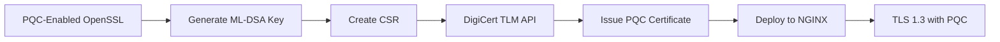

# Post-Quantum Cryptography (PQC) Demo Lab

[](https://www.openssl.org/)
[](https://nginx.org/)
[](https://csrc.nist.gov/Projects/post-quantum-cryptography)
[](https://www.digicert.com/)

A comprehensive guide for setting up a Post-Quantum Cryptography demonstration environment using NIST-standardized ML-DSA (formerly Dilithium) algorithms, OpenSSL 3.5.1+, NGINX, and DigiCert Trust Lifecycle Manager.

## 🔐 Table of Contents

- [Overview](#overview)
- [Architecture](#architecture)
- [Prerequisites](#prerequisites)
- [Quick Start](#quick-start)
- [Detailed Installation](#detailed-installation)
  - [1. OpenSSL PQC Setup](#1-openssl-pqc-setup)
  - [2. DigiCert TLM Configuration](#2-digicert-tlm-configuration)
  - [3. Certificate Generation](#3-certificate-generation)
  - [4. NGINX PQC Configuration](#4-nginx-pqc-configuration)
- [Automated Script](#automated-script)
- [Testing & Verification](#testing--verification)
- [Supported Algorithms](#supported-algorithms)
- [Troubleshooting](#troubleshooting)
- [Security Considerations](#security-considerations)
- [Resources](#resources)

## 🎯 Overview

This lab environment demonstrates the practical implementation of Post-Quantum Cryptography using NIST-standardized algorithms. It provides a complete workflow for generating, issuing, and deploying quantum-resistant certificates in a real-world web server environment.

### Key Features

- **NIST-Standardized Algorithms**: Implementation of ML-DSA (Module-Lattice Digital Signature Algorithm)
- **Complete PKI Integration**: Full integration with DigiCert Trust Lifecycle Manager
- **Production-Ready Web Server**: NGINX compiled with PQC support
- **Automated Workflows**: Scripts for certificate lifecycle management
- **Hybrid Mode Support**: Compatible with classical and PQC algorithms

### What You'll Build



## 🏗️ Architecture

The PQC Demo Lab consists of several integrated components:

1. **OpenSSL 3.5.1+** - Compiled with PQC algorithm support
2. **DigiCert TLM** - Certificate authority with PQC profile support
3. **NGINX** - Web server compiled against PQC-enabled OpenSSL
4. **Automation Scripts** - Streamlined certificate management

### Component Diagram

```
┌─────────────────────────────────────────────────────────────┐
│                     DigiCert TLM Platform                    │
│  ┌──────────────┐  ┌──────────────┐  ┌──────────────┐      │
│  │ PQC Root CA  │  │   PQC ICA    │  │ API Profile  │      │
│  └──────────────┘  └──────────────┘  └──────────────┘      │
└────────────────────────────┬────────────────────────────────┘
                             │ API
                             ▼
┌─────────────────────────────────────────────────────────────┐
│                      Local Environment                       │
│  ┌──────────────┐  ┌──────────────┐  ┌──────────────┐      │
│  │OpenSSL 3.5.1 │──│ Certificate  │──│    NGINX     │      │
│  │   with PQC   │  │  Generation  │  │  with PQC    │      │
│  └──────────────┘  └──────────────┘  └──────────────┘      │
└─────────────────────────────────────────────────────────────┘
```

## 📋 Prerequisites

### System Requirements

- **Operating System**: Ubuntu 20.04 LTS or later (tested on Ubuntu 22.04)
- **CPU**: x86_64 architecture
- **RAM**: Minimum 2GB
- **Storage**: 10GB free space
- **Network**: Internet connectivity for package installation and API access

### Required Accounts

- **DigiCert Account**: Access to DigiCert ONE platform with TLM module
- **API Credentials**: Valid API key with certificate issuance permissions

### Software Dependencies

```bash
# Core build tools
build-essential
git
wget
jq
perl
python3
make

# Library dependencies
zlib1g-dev
libssl-dev
libpcre3
libpcre3-dev
```

## 🚀 Quick Start

For experienced users, here's the rapid deployment path:

```bash
# 1. Clone the repository
git clone https://github.com/your-org/pqc-demo-lab.git
cd pqc-demo-lab

# 2. Run the setup script
chmod +x setup-pqc-environment.sh
./setup-pqc-environment.sh

# 3. Configure your API credentials
export DIGICERT_API_KEY="your_api_key_here"
export DIGICERT_PROFILE_ID="your_profile_id_here"

# 4. Generate and deploy a certificate
./pqc-certificate-manager.sh
```

## 📖 Detailed Installation

### 1. OpenSSL PQC Setup

#### Step 1.1: Install Prerequisites

```bash
sudo apt update
sudo apt install -y build-essential jq git perl python3 make wget zlib1g-dev libssl-dev
```

#### Step 1.2: Clone and Configure OpenSSL

```bash
# Clone the OpenSSL repository
git clone https://github.com/openssl/openssl.git
cd openssl

# Configure with PQC support
./Configure --prefix=/opt/openssl-pqc linux-x86_64
```

#### Step 1.3: Compile and Install

```bash
# Compile using all available cores
make -j$(nproc)

# Install to /opt/openssl-pqc
sudo make install
```

#### Step 1.4: Configure Environment

```bash
# Add to current session
export PATH="/opt/openssl-pqc/bin:$PATH"
export LD_LIBRARY_PATH=/opt/openssl-pqc/lib64:$LD_LIBRARY_PATH

# Add permanently to ~/.bashrc
echo 'export PATH="/opt/openssl-pqc/bin:$PATH"' >> ~/.bashrc
echo 'export LD_LIBRARY_PATH=/opt/openssl-pqc/lib64:$LD_LIBRARY_PATH' >> ~/.bashrc
source ~/.bashrc
```

#### Step 1.5: Verify PQC Support

```bash
# Check for ML-DSA algorithms
openssl list -public-key-algorithms | grep ML

# Expected output includes:
# ML-DSA-44, ML-DSA-65, ML-DSA-87
# ML-KEM-512, ML-KEM-768, ML-KEM-1024
```

### 2. DigiCert TLM Configuration

#### Step 2.1: Create PQC Certificate Hierarchy

1. Log into DigiCert ONE platform
2. Navigate to Trust Lifecycle Manager
3. Create new Root CA with ML-DSA algorithm
4. Create Intermediate CA (ICA) under the PQC root
5. Create API Profile using the PQC CA chain


#### Step 2.2: Configure API Profile

1. Select **ML-DSA-65** as the signature algorithm
2. Configure validity period and key usage
3. Note the Profile ID for API calls
4. Generate API key with certificate issuance permissions


### 3. Certificate Generation

#### Step 3.1: Create CSR Configuration

Create `csr.conf`:

```ini
[ req ]
distinguished_name = req_distinguished_name
prompt = no

[ req_distinguished_name ]
CN = tlsguru.io
O = DigiCert
C = US
```

#### Step 3.2: Generate ML-DSA Private Key

```bash
openssl genpkey -algorithm MLDSA65 -out mldsa65_key.pem
```

#### Step 3.3: Generate Certificate Signing Request

```bash
openssl req -new -key mldsa65_key.pem -out mldsa65_csr.pem -config csr.conf
```

#### Step 3.4: Submit CSR via API

Use the provided `issuance.sh` script or make a direct API call:

```bash
./issuance.sh mldsa65_csr.pem
```

### 4. NGINX PQC Configuration

#### Step 4.1: Install NGINX Prerequisites

```bash
sudo apt install -y libpcre3 libpcre3-dev zlib1g-dev
```

#### Step 4.2: Download and Extract NGINX

```bash
wget http://nginx.org/download/nginx-1.27.4.tar.gz
tar zxf nginx-1.27.4.tar.gz
cd nginx-1.27.4
```

#### Step 4.3: Configure NGINX with PQC OpenSSL

```bash
./configure --with-cc-opt='-g -O2 -fstack-protector-strong -Wformat -Werror=format-security -fPIC -Wdate-time -D_FORTIFY_SOURCE=2' \
    --with-ld-opt='-Wl,-z,relro -Wl,-z,now -fPIC' \
    --prefix=/opt \
    --conf-path=/opt/nginx/nginx.conf \
    --http-log-path=/var/log/nginx/access.log \
    --error-log-path=/var/log/nginx/error.log \
    --with-http_ssl_module \
    --with-http_v2_module \
    --with-ld-opt="-L/opt/openssl-pqc/lib64 -Wl,-rpath,/opt/openssl-pqc/lib64" \
    --with-cc-opt="-I/opt/openssl-pqc/include"
```

#### Step 4.4: Compile and Install NGINX

```bash
make -j$(nproc)
sudo make install

# Create required directories
sudo mkdir -p /var/lib/nginx
sudo mkdir -p /opt/nginx/conf.d
```

#### Step 4.5: Configure NGINX for PQC

Create `/opt/nginx/conf.d/pqc.conf`:

```nginx
server {
    listen 443 ssl;
    listen [::]:443 ssl;
    server_name example.com www.example.com;

    root /var/www/example.com;
    index index.html index.php;

    ssl_certificate /opt/certs/pqc.crt;
    ssl_certificate_key /opt/certs/pqc.key;

    ssl_protocols TLSv1.3;
    ssl_prefer_server_ciphers on;
    ssl_ecdh_curve X25519MLKEM768;

    location / {
        try_files $uri $uri/ =404;
    }
}
```

#### Step 4.6: Create systemd Service

Create `/etc/systemd/system/nginx.service`:

```ini
[Unit]
Description=The NGINX HTTP and reverse proxy server
After=network.target remote-fs.target nss-lookup.target

[Service]
Type=forking
PIDFile=/run/nginx.pid
ExecStartPre=/opt/sbin/nginx -t
ExecStart=/opt/sbin/nginx
ExecReload=/opt/sbin/nginx -s reload
ExecStop=/opt/sbin/nginx -s stop
PrivateTmp=true

[Install]
WantedBy=multi-user.target
```

#### Step 4.7: Start NGINX

```bash
sudo systemctl daemon-reload
sudo systemctl enable nginx
sudo systemctl start nginx
```

## 🤖 Automated Script

The comprehensive automation script handles the entire certificate lifecycle:

### Features

- Interactive configuration wizard
- Automatic CSR generation with ML-DSA algorithms
- API integration with DigiCert TLM
- Full chain certificate creation
- Automatic NGINX configuration updates
- Backup and rollback capabilities

### Usage

```bash
# Run the automated script
./pqc-certificate-manager.sh

# Follow the interactive prompts:
# - Enter Common Name
# - Specify file locations
# - Provide API credentials
# - Choose bundle method
```

### Script Configuration Options

| Parameter | Description | Default |
|-----------|-------------|---------|
| Common Name | Certificate subject CN | `digicert.local` |
| Key Algorithm | PQC signature algorithm | `MLDSA65` |
| Bundle Method | Certificate chain bundling | `force` |
| Update NGINX | Auto-update web server config | `yes` |

## 🧪 Testing & Verification

### Verify Certificate Installation

```bash
# Test TLS connection with PQC certificate
openssl s_client -connect localhost:443 -servername localhost

# Expected output includes:
# Peer signature type: mldsa65
# Negotiated TLS1.3 group: X25519MLKEM768
```

### Check Certificate Details

```bash
# View certificate information
openssl x509 -in /opt/certs/pqc.crt -text -noout

# Verify signature algorithm
openssl x509 -in /opt/certs/pqc.crt -text -noout | grep "Signature Algorithm"
```

### Performance Testing

```bash
# Basic performance test
openssl speed mldsa65

# TLS handshake performance
for i in {1..100}; do
    time openssl s_client -connect localhost:443 -servername localhost < /dev/null 2>/dev/null
done
```

## 🔬 Supported Algorithms

### Digital Signature Algorithms (ML-DSA)

| Algorithm | Security Level | Public Key Size | Signature Size | Use Case |
|-----------|---------------|-----------------|----------------|----------|
| ML-DSA-44 | NIST Level 2 | 1,312 bytes | 2,420 bytes | IoT, Embedded |
| ML-DSA-65 | NIST Level 3 | 1,952 bytes | 3,293 bytes | General Purpose |
| ML-DSA-87 | NIST Level 5 | 2,592 bytes | 4,595 bytes | High Security |

### Key Encapsulation Mechanisms (ML-KEM)

| Algorithm | Security Level | Public Key Size | Ciphertext Size |
|-----------|---------------|-----------------|-----------------|
| ML-KEM-512 | NIST Level 1 | 800 bytes | 768 bytes |
| ML-KEM-768 | NIST Level 3 | 1,184 bytes | 1,088 bytes |
| ML-KEM-1024 | NIST Level 5 | 1,568 bytes | 1,568 bytes |

### Hybrid Modes

| Configuration | Classical | PQC | Use Case |
|--------------|-----------|-----|----------|
| X25519MLKEM768 | X25519 | ML-KEM-768 | TLS 1.3 Default |
| P256MLKEM768 | P-256 | ML-KEM-768 | FIPS Compliance |
| P384MLKEM1024 | P-384 | ML-KEM-1024 | High Security |

## 🔧 Troubleshooting

### Common Issues and Solutions

#### OpenSSL PQC Algorithms Not Found

```bash
# Issue: ML-DSA algorithms not listed
# Solution: Verify OpenSSL compilation and PATH
which openssl  # Should show /opt/openssl-pqc/bin/openssl
openssl version  # Should show 3.5.1 or later
```

#### Certificate Generation Fails

```bash
# Issue: API returns 400 Bad Request
# Solution: Verify CSR format
openssl req -in mldsa65_csr.pem -text -noout -verify

# Check API credentials
curl -X GET "https://demo.one.digicert.com/mpki/api/v1/profile" \
     -H "x-api-key: YOUR_API_KEY"
```

#### NGINX SSL Handshake Failure

```bash
# Issue: SSL handshake fails
# Solution: Check NGINX is compiled with PQC OpenSSL
/opt/sbin/nginx -V 2>&1 | grep "built with OpenSSL"

# Verify certificate chain
openssl verify -CAfile root.pem -untrusted ica.pem cert.pem
```

#### Browser Compatibility

> **Note**: As of 2025, mainstream browsers do not yet support PQC certificates natively. Testing must be performed using:
> - OpenSSL command-line tools
> - Custom-compiled browsers with PQC support
> - Specialized PQC testing tools

### Debug Mode

Enable detailed logging for troubleshooting:

```bash
# OpenSSL debug
export OPENSSL_DEBUG=1

# NGINX debug logs
error_log /var/log/nginx/error.log debug;

# Script debug mode
DEBUG_MODE=true ./pqc-certificate-manager.sh
```

## 🔒 Security Considerations

### Production Deployment

⚠️ **This is a demonstration environment**. For production use:

1. **Key Protection**
   - Store private keys in HSM or secure key management system
   - Implement proper key rotation policies
   - Use appropriate file permissions (600 for keys)

2. **Certificate Management**
   - Implement automated renewal before expiration
   - Monitor certificate transparency logs
   - Maintain secure backup of certificates and keys

3. **Network Security**
   - Implement proper firewall rules
   - Use secure channels for API communication
   - Enable rate limiting on certificate endpoints

4. **Compliance**
   - Ensure compliance with relevant standards (FIPS, Common Criteria)
   - Document cryptographic agility strategy
   - Plan for algorithm migration

### Quantum Threat Timeline

- **2025-2030**: Harvest now, decrypt later attacks
- **2030-2035**: Early quantum computers pose limited threat
- **2035+**: Cryptographically relevant quantum computers expected

## 📚 Resources

### Documentation

- [NIST Post-Quantum Cryptography](https://csrc.nist.gov/Projects/post-quantum-cryptography)
- [OpenSSL PQC Documentation](https://www.openssl.org/docs/)
- [DigiCert TLM API Reference](https://dev.digicert.com/)
- [NGINX SSL Configuration](https://nginx.org/en/docs/http/ngx_http_ssl_module.html)

### Standards and Specifications

- [FIPS 204: ML-DSA Standard](https://nvlpubs.nist.gov/nistpubs/FIPS/NIST.FIPS.204.pdf)
- [FIPS 203: ML-KEM Standard](https://nvlpubs.nist.gov/nistpubs/FIPS/NIST.FIPS.203.pdf)
- [X.509 Certificate Profile for PQC](https://datatracker.ietf.org/doc/draft-ietf-lamps-dilithium-certificates/)

### Community and Support

- [OpenSSL Mailing Lists](https://www.openssl.org/community/mailinglists.html)
- [DigiCert Support Portal](https://www.digicert.com/support)
- [NIST PQC Forum](https://groups.google.com/a/list.nist.gov/g/pqc-forum)

## 📄 License

This demonstration code is provided under the MIT License. See [LICENSE](LICENSE) file for details.

**Note**: DigiCert components are subject to their respective licensing terms.

## 🤝 Contributing

Contributions are welcome! Please:

1. Fork the repository
2. Create a feature branch
3. Commit your changes
4. Push to the branch
5. Open a Pull Request

## 📧 Contact

For questions and support:
- Technical Issues: [Open an issue](https://github.com/your-org/pqc-demo-lab/issues)
- Security Concerns: security@your-org.com
- DigiCert Support: [DigiCert Support Portal](https://www.digicert.com/support)

---

**Version**: 1.0.0  
**Last Updated**: July 2025  
**Maintained By**: Your Organization Name