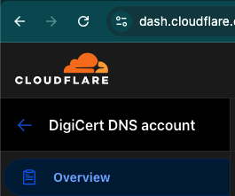
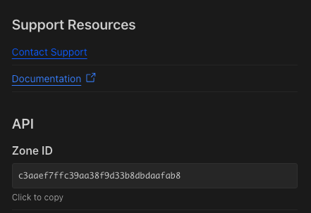
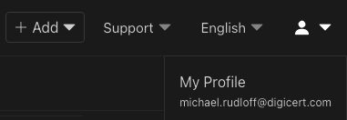
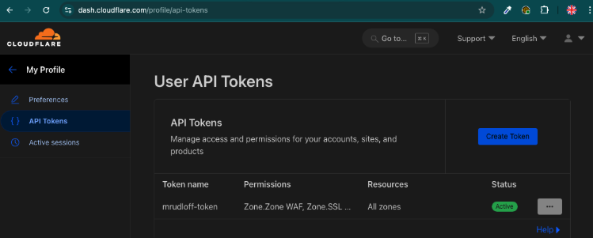

# Cloudflare Integration: Issue certificate and upload to Cloudflare

We are using the API to upload a custom certificate. A custom certificate is a certificate that is being issued outside of Cloudflare and subsequently uploaded. Otherwise a certificate from Cloudflare needs to be used.

The API reference can be found here: [https://developers.cloudflare.com/api-next/resources/custom_certificates/](https://developers.cloudflare.com/api-next/resources/custom_certificates/)

There are two main requirements for a successful API call.

* ZoneID
* API Token

## Zone ID

Click on `Overview`

On the right-hand side scroll all the way down to `ZoneID`

## API Token

To create an API Token, select your profile `My Profile`

Create an API Token with the following permissions

