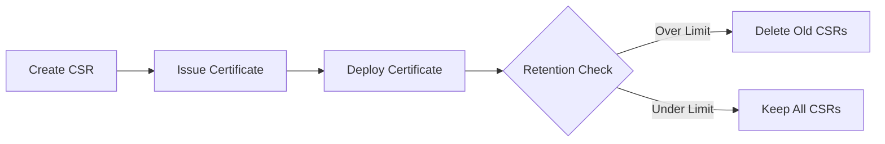

# Cloudflare-DigiCert Certificate Automation Script

[](https://developers.cloudflare.com/api/)
[](https://dev.digicert.com/)
[](https://www.gnu.org/software/bash/)
[](LICENSE)

Automated SSL/TLS certificate lifecycle management for Cloudflare zones using DigiCert Trust Lifecycle Manager (TLM). This script automates CSR generation, certificate issuance, deployment, and renewal with intelligent CSR cleanup capabilities.

## 📋 Table of Contents

- [Features](#features)
- [Prerequisites](#prerequisites)
- [Installation](#installation)
- [Configuration](#configuration)
- [Usage](#usage)
  - [Interactive Mode](#interactive-mode)
  - [Renewal Mode](#renewal-mode)
- [Automation Setup](#automation-setup)
- [CSR Management](#csr-management)
- [Logging](#logging)
- [Security](#security)
- [Troubleshooting](#troubleshooting)
- [API Reference](#api-reference)
- [Legal Notice](#legal-notice)

## ✨ Features

### Core Capabilities
- **Automated Certificate Lifecycle**: End-to-end automation from CSR generation to certificate deployment
- **Dual Mode Operation**: Interactive mode for manual execution, renewal mode for scheduled automation
- **Intelligent CSR Management**: Automatic cleanup of old CSRs with configurable retention policies
- **Certificate Replacement**: Seamless replacement of existing certificates with zero downtime
- **SAN Support**: Automatic inclusion of www subdomain in certificate SANs
- **Comprehensive Logging**: Detailed logging with sensitive data protection

### Advanced Features
- **Zone Auto-Detection**: Automatically determines domain from Cloudflare zone ID
- **Existing Certificate Detection**: Checks for and manages existing certificates
- **CSR Retention Policy**: Configurable retention of historical CSRs (0-unlimited)
- **Bundle Method Support**: Force bundle method for optimal compatibility
- **Certificate Validation**: Automatic validation of issued certificates
- **Error Recovery**: Robust error handling with detailed diagnostics

## 📦 Prerequisites

### System Requirements
- **Operating System**: Linux/Unix with Bash 4.0+
- **Required Tools**:
  - `curl` - API communication
  - `jq` - JSON processing
  - `openssl` - Certificate validation (optional)
  - `tee` - Logging functionality

### Account Requirements

#### Cloudflare
- Active Cloudflare account with zone management access
- API Token with permissions:
  - `Zone:SSL and Certificates:Edit`
  - `Zone:SSL and Certificates:Read`
  - `Zone:Read`

#### DigiCert
- DigiCert ONE account with TLM access
- API Key with certificate issuance permissions
- Configured certificate profile in TLM

## 🚀 Installation

### 1. Download the Script

```bash
# Using wget
wget https://raw.githubusercontent.com/your-org/cert-automation/main/cert_automation.sh

# Or using curl
curl -O https://raw.githubusercontent.com/your-org/cert-automation/main/cert_automation.sh
```

### 2. Make Executable

```bash
chmod +x cert_automation.sh
```

### 3. Accept Legal Notice

Edit the script and change the legal notice acceptance:

```bash
# Change from:
LEGAL_NOTICE_ACCEPT="false"

# To:
LEGAL_NOTICE_ACCEPT="true"
```

### 4. Verify Dependencies

```bash
# Check required commands
for cmd in curl jq tee; do
    command -v $cmd >/dev/null 2>&1 || echo "Missing: $cmd"
done

# Install missing dependencies (Ubuntu/Debian)
sudo apt-get update
sudo apt-get install -y curl jq
```

## ⚙️ Configuration

### Default Configuration Values

The script includes default values that can be customized:

```bash
DEFAULT_ZONE_ID="your_cloudflare_zone_id"
DEFAULT_AUTH_TOKEN="your_cloudflare_auth_token"
DEFAULT_DIGICERT_API_KEY="your_digicert_api_key"
DEFAULT_PROFILE_ID="your_digicert_profile_id"
DEFAULT_LOG_FILE="./digicert_cert_automation_$(date +%Y%m%d_%H%M%S).log"
DEFAULT_CSR_RETENTION="5"
```

### Configuration Methods

#### Method 1: Edit Script Defaults
Modify the default values directly in the script for permanent configuration.

#### Method 2: Interactive Input
Run the script without modifications and enter values when prompted.

#### Method 3: Environment Variables (Future Enhancement)
```bash
export CLOUDFLARE_ZONE_ID="your_zone_id"
export CLOUDFLARE_AUTH_TOKEN="your_token"
export DIGICERT_API_KEY="your_api_key"
export DIGICERT_PROFILE_ID="your_profile_id"
```

## 📘 Usage

### Interactive Mode

Default mode with user prompts for configuration and confirmation:

```bash
./cert_automation.sh
```

#### Interactive Mode Flow:
1. Legal notice acceptance check
2. Configuration prompts (with defaults)
3. Zone verification and domain detection
4. Existing certificate check
5. CSR generation at Cloudflare
6. Certificate issuance via DigiCert
7. Certificate upload to Cloudflare
8. Old CSR cleanup
9. Optional certificate file saving

### Renewal Mode

Automated mode for scheduled execution without prompts:

```bash
./cert_automation.sh --renewal
```

#### Renewal Mode Features:
- Uses all default configuration values
- No user interaction required
- Automatically replaces existing certificates
- Saves certificate files without prompting
- Perfect for cron jobs and automation

### Command Line Options

```bash
# Show help
./cert_automation.sh --help

# Run in renewal mode
./cert_automation.sh --renewal
```

## 🔄 Automation Setup

### Cron Job Configuration

#### Daily Renewal (Recommended)
```bash
# Check and renew daily at 2:00 AM
0 2 * * * /path/to/cert_automation.sh --renewal >> /var/log/cert_renewal.log 2>&1
```

#### Weekly Renewal
```bash
# Run every Sunday at 2:00 AM
0 2 * * 0 /path/to/cert_automation.sh --renewal >> /var/log/cert_renewal.log 2>&1
```

#### Monthly Renewal
```bash
# Run on the 1st of each month at 2:00 AM
0 2 1 * * /path/to/cert_automation.sh --renewal >> /var/log/cert_renewal.log 2>&1
```

### Systemd Timer (Alternative)

Create `/etc/systemd/system/cert-renewal.service`:

```ini
[Unit]
Description=Certificate Renewal Service
After=network-online.target
Wants=network-online.target

[Service]
Type=oneshot
ExecStart=/path/to/cert_automation.sh --renewal
StandardOutput=journal
StandardError=journal
```

Create `/etc/systemd/system/cert-renewal.timer`:

```ini
[Unit]
Description=Daily Certificate Renewal
Requires=cert-renewal.service

[Timer]
OnCalendar=daily
Persistent=true

[Install]
WantedBy=timers.target
```

Enable the timer:
```bash
sudo systemctl enable cert-renewal.timer
sudo systemctl start cert-renewal.timer
```

## 🗂️ CSR Management

### Retention Policy

The script implements intelligent CSR cleanup with configurable retention:

| Setting | Behavior |
|---------|----------|
| `0` | Delete all old CSRs after successful certificate deployment |
| `1-n` | Keep the n most recent CSRs, delete older ones |
| Default (`5`) | Keep 5 most recent CSRs |

### CSR Lifecycle



### Manual CSR Management

```bash
# List all CSRs for a zone
curl -X GET "https://api.cloudflare.com/client/v4/zones/{zone_id}/custom_csrs" \
     -H "Authorization: Bearer {auth_token}"

# Delete specific CSR
curl -X DELETE "https://api.cloudflare.com/client/v4/zones/{zone_id}/custom_csrs/{csr_id}" \
     -H "Authorization: Bearer {auth_token}"
```

## 📝 Logging

### Log Levels and Information

The script provides comprehensive logging with different verbosity levels:

| Level | Information | Destination |
|-------|-------------|-------------|
| Standard | Operations, status, errors | Console + Log File |
| Sensitive | API responses, tokens (masked) | Log File Only |
| Debug | Full API responses | Log File Only |

### Log File Structure

```
============================== Certificate Automation Log ==============================
Started: Wed Jan 15 14:30:00 UTC 2025
Mode: RENEWAL (Automated)
Configuration: CSR Retention = 5
========================================================================================

Step 0: Fetching zone details from Cloudflare...
✓ Zone found:
  Domain: example.com
  Status: active

Step 1: Checking for existing certificates...
[... detailed process logs ...]

========================================================================================
Completed: Wed Jan 15 14:30:15 UTC 2025
========================================================================================
```

### Log Rotation

Implement log rotation to manage log file sizes:

```bash
# Create /etc/logrotate.d/cert-automation
/var/log/cert_renewal.log {
    daily
    rotate 30
    compress
    delaycompress
    notifempty
    create 640 root adm
}
```

## 🔒 Security

### Best Practices

#### 1. Credential Protection
- **Never commit credentials** to version control
- Store sensitive values in environment variables or secure vaults
- Use read-only permissions for configuration files

#### 2. API Token Scoping
- Create Cloudflare API tokens with minimal required permissions
- Use zone-specific tokens when possible
- Regularly rotate API credentials

#### 3. File Permissions
```bash
# Restrict script permissions
chmod 700 cert_automation.sh

# Secure log directory
chmod 750 /var/log/cert-automation/
chown root:adm /var/log/cert-automation/
```

#### 4. Audit and Monitoring
- Review logs regularly for anomalies
- Set up alerts for failed renewals
- Monitor certificate expiration dates

### Sensitive Data Handling

The script implements several security measures:

- API tokens are masked in console output
- Full tokens only appear in log files (ensure proper file permissions)
- Option to read credentials from environment variables
- Secure storage of generated certificates

## 🔍 Troubleshooting

### Common Issues

#### Issue: Legal Notice Not Accepted
```
LEGAL NOTICE NOT ACCEPTED
Script execution terminated.
```
**Solution**: Edit the script and set `LEGAL_NOTICE_ACCEPT="true"`

#### Issue: Zone Not Found
```
Error: Could not fetch zone details
```
**Solution**: Verify Zone ID and API token permissions

#### Issue: CSR Creation Fails
```
Error creating CSR at Cloudflare
```
**Solution**: Check API token has SSL certificate edit permissions

#### Issue: Certificate Not Issued
```
Error: No certificate received from DigiCert
```
**Solution**: 
- Verify DigiCert API key and profile ID
- Check profile configuration in DigiCert TLM
- Ensure profile is active and has available seats

#### Issue: Certificate Upload Fails
```
Error creating certificate in Cloudflare
```
**Solution**: 
- Verify the certificate format is correct
- Check for existing certificates with same hostname
- Ensure CSR ID matches the certificate

### Debug Mode

Enable verbose logging by modifying the script:

```bash
# Add debug flag at the top of the script
DEBUG=true

# Add debug output throughout
[[ "$DEBUG" == "true" ]] && echo "Debug: Variable = $VARIABLE"
```

### Validation Commands

```bash
# Verify Cloudflare API access
curl -X GET "https://api.cloudflare.com/client/v4/user/tokens/verify" \
     -H "Authorization: Bearer REMOVED_SECRET"

# Check DigiCert API access
curl -X GET "https://demo.one.digicert.com/mpki/api/v1/profile" \
     -H "x-api-key: REMOVED_SECRET"

# Validate certificate
openssl x509 -in certificate.pem -text -noout
```

## 📚 API Reference

### Cloudflare API Endpoints

| Operation | Endpoint | Method |
|-----------|----------|--------|
| Get Zone Details | `/zones/{zone_id}` | GET |
| List Certificates | `/zones/{zone_id}/custom_certificates` | GET |
| Create CSR | `/zones/{zone_id}/custom_csrs` | POST |
| Upload Certificate | `/zones/{zone_id}/custom_certificates` | POST |
| Delete Certificate | `/zones/{zone_id}/custom_certificates/{cert_id}` | DELETE |
| Delete CSR | `/zones/{zone_id}/custom_csrs/{csr_id}` | DELETE |

### DigiCert API Endpoints

| Operation | Endpoint | Method |
|-----------|----------|--------|
| Issue Certificate | `/mpki/api/v1/certificate` | POST |
| Get Profile | `/mpki/api/v1/profile/{profile_id}` | GET |

## ⚖️ Legal Notice

Copyright © 2024 DigiCert. All rights reserved.

This software is provided by DigiCert under license. Use is subject to the terms and conditions of your agreement with DigiCert. The software is provided "AS IS" without warranties of any kind.

**Export Compliance**: This software is subject to U.S. export control laws and regulations.

For complete legal terms, review the legal notice in the script header.

## 📞 Support

### Resources
- [Cloudflare SSL/TLS Documentation](https://developers.cloudflare.com/ssl/)
- [DigiCert TLM Documentation](https://dev.digicert.com/)
- [Script Issues](https://github.com/your-org/cert-automation/issues)

### Contact
- Technical Support: support@your-org.com
- Security Issues: security@your-org.com

---

**Version**: 1.0.0  
**Last Updated**: January 2025  
**Maintained By**: Your Organization Name